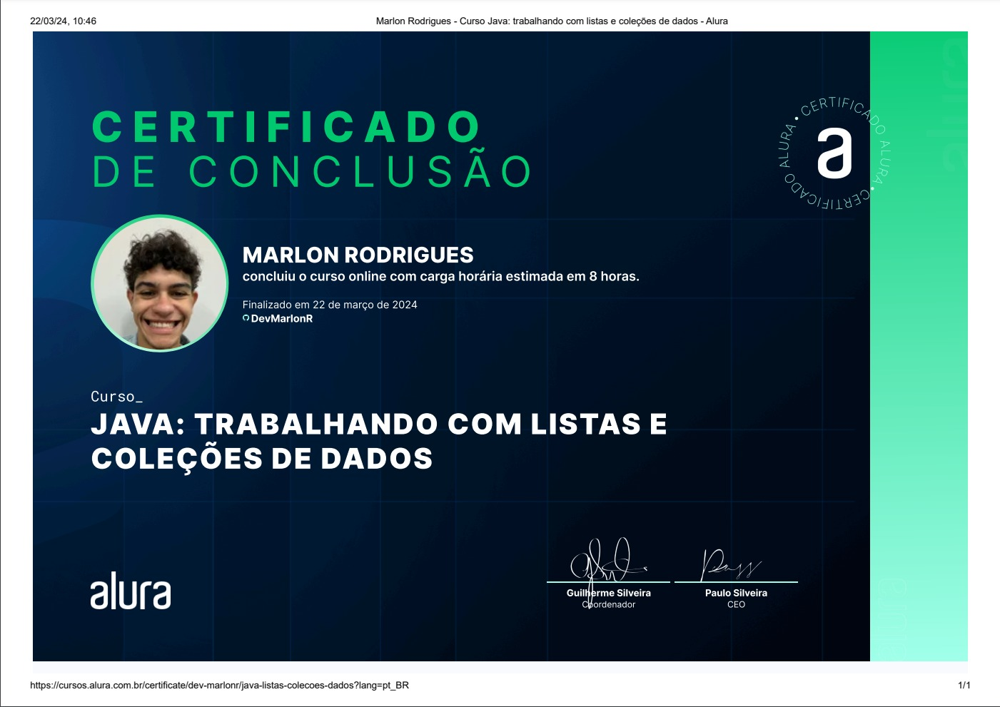

# Repositorio Java Trabalhando Com Listas e Coleções De Dados

<a href="https://giphy.com/gifs/UQSportMarketing-uq-uqsport-uniofqld-dWOKEQ5ewh94RJLemj">GIPHY</a>

Repositório destinado ao curso Java: trabalhando com listas e coleções de dados, da plataforma Alura, onde foi abordado temas como: 
 - Utilização de listas e coleções de dados em Java, como o ArrayList

 - Manipulação de dados em uma Lista, incluindo: 
     Adicionar elementos;
     percorrer a lista;
     definir o tipo de elementos (Podendo ser primitivo ou uma Classe);
     obter o tamanho da lista.

 - Utilização do operador instanceof para identificar o tipo de uma instância

 - Aprofundamento nos conceitos da classe Object e suas hierarquias

 - Criação de construtores para inicialização de objetos com valores pré-definidos

 - Definição de diferentes formas de ordenação para a lista, incluindo a Interface Comparable ou o método do ArrayList.sort()

 - Desenvolvimento de uma nova aplicação como desafio final do curso

 ### Abaixo encontra-se o certificado do Curso.

